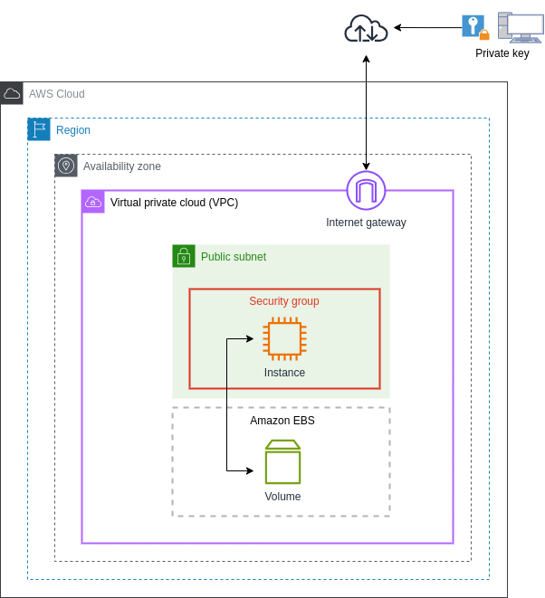

# Terraform with AWS EC2

This repository contains a Terraform configuration to create one or multiple EC2 instances in AWS.

## Architecture

<p align="center">
  </a>
</p>

## Setup
1. Clone the file ```terraform.tfvars.backup``` and rename it to ```terraform.tfvars```
2. Fill in the variables in ```terraform.tfstate```
1. terraform init
2. terraform plan
3. terraform apply

## Connect to instance

1. In this directory there is a file ``.pem`` file
2. Execute `terraform output` to get the public IP
3. Use ssh for connect to the instance
```sh
ssh -i "{{aws_key_name}}.pem" ubuntu@public-ip
```
